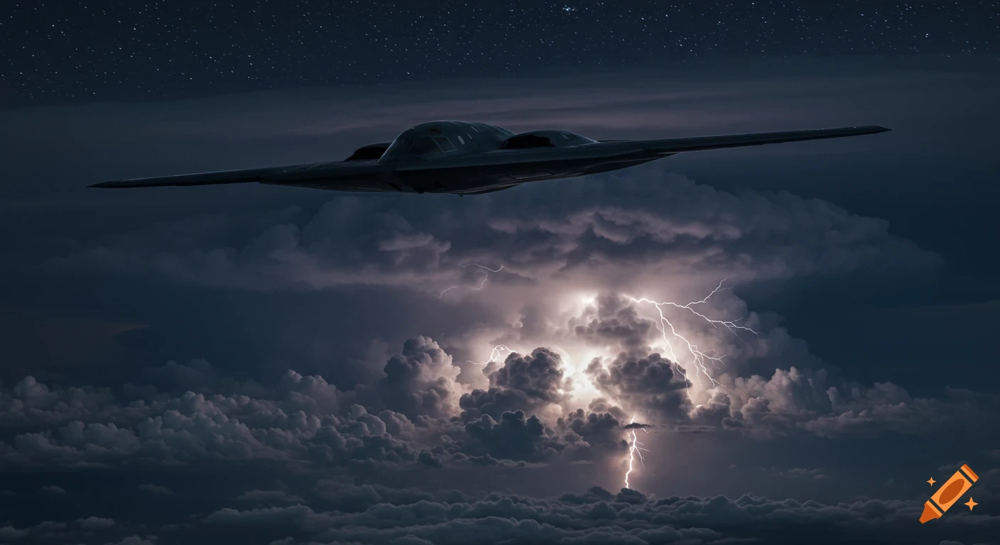

<!-- Mets l'image vol.jpg dans ton dossier assets -->
<p align="center">
  
</p>

<h1 align="center">✈️ FANTÔME DU CIEL</h1>

<p align="center">
  <i>« Si vous le voyez, c'est que vous êtes déjà mort. »</i>
</p>

<p align="center">
  Un site vitrine dédié au bombardier furtif <b>Northrop B-2 Spirit</b>.<br>
  Projet de groupe - Holberton School France.
</p>

<p align="center">
  
  
  
</p>

---

## 🎯 Le projet

**Fantôme du Ciel** est un site vitrine d'une seule application, construit en **HTML et CSS purs**, sans aucun framework (ni Bootstrap, ni Tailwind). Seules les polices Google Fonts sont chargées en externe.

Le site présente le B-2 Spirit à travers cinq thèmes : son accueil, sa furtivité, ses missions de combat, ses caractéristiques et son armement.

---

## 📄 Les pages

| Page | Fichier | Contenu |
|------|---------|---------|
| 🏠 **Accueil** | `index.html` | Hero plein écran avec vidéo de fond, bandes cinéma, navigation. |
| 🛡️ **Furtivité** | `index.html#furtivite` | Pourquoi le B-2 est invisible aux radars. |
| 🎯 **Mission** | `mission.html` | Trois opérations de combat réelles. |
| 🔧 **Caractéristiques** | `index.html#caracteristiques` | Les spécifications techniques de l'appareil. |
| 💥 **Armement** | `armement.html` | Les moyens d'attaque, bombes et missile standoff. |

---

## 🛡️ Page Furtivité

*Un avion de 52 mètres d'envergure, pensé pour apparaître comme une ombre.*

Le B-2 Spirit n'est pas seulement sombre : toute sa silhouette est pensée pour réduire les signatures radar, infrarouge, acoustique, électromagnétique et visuelle.

- **La silhouette qui dévie les radars** — sans dérive verticale, son aile volante casse la silhouette classique d'un avion et limite les angles capables de renvoyer les ondes radar vers leur source.
- **Un revêtement qui absorbe les ondes** — les matériaux absorbants (RAM, *Radar Absorbent Material*) absorbent une partie des ondes radar au lieu de les renvoyer vers l'antenne ennemie.
- **Chaleur masquée** — les moteurs intégrés dans l'aile et les tuyères en V dispersent les gaz chauds pour réduire la signature thermique.

---

## 🎯 Page Mission

Le récit de trois frappes réelles, de la plus récente à la plus ancienne :

- **Iran · 2025** — Opération Midnight Hammer. Sept B-2 frappent le site nucléaire de Fordow avec des bombes anti-bunker GBU-57.
- **Afghanistan · 2001** — La plus longue mission de combat de l'histoire : 44 heures de vol.
- **Libye · 2017** — Frappe de nuit contre un camp d'entraînement de l'État islamique.

---

## 📊 Page Caractéristiques

*Deux pilotes, une aile de 52 mètres et assez de carburant pour traverser un continent sans escale.*

| Caractéristique | Valeur |
|-----------------|--------|
| Envergure | 52,12 m |
| Charge utile | 27 216 kg (jusqu'à 60 000 livres en soute) |
| Masse au décollage | 152 634 kg |
| Carburant | 75 750 kg |
| Rayon d'action | 9 600 km sans ravitaillement |
| Plafond | 15 240 m |
| Propulsion | 4 moteurs General Electric F118-GE-100 |
| Équipage | 2 (un pilote, un commandant de mission) |
| Coût unitaire | 1,157 Md $ (dollars constants 1998) |

Le B-2 ne choque pas par sa vitesse, mais parce qu'il combine une charge de bombardier lourd, une portée intercontinentale et une signature réduite dans un seul appareil.

---

## 💥 Page Armement

Deux familles d'armes clairement distinguées :

- **Les bombes** — GBU-57 MOP (anti-bunker), JDAM (guidée GPS), B61/B83 (nucléaire).
- **Le missile standoff** — AGM-158 JASSM, qui frappe à plus de 1 000 km : *« il frappe, puis s'efface »*.

---

## 🎨 Design

- Palette sombre **bleu acier** pour une ambiance furtive et nocturne.
- Typographie : **Playfair Display** (titres) et **Raleway** (texte), via Google Fonts.
- Logo **FDC** en hexagone.
- Effets au survol : cartes qui se soulèvent, liens animés, bordures qui s'allument.
- Mise en page **responsive** (passage en une colonne sur mobile).

---

## 🗂️ Structure du projet

```
holberton-school-project-fantome-du-ciel/
├── index.html          # Accueil + Furtivité + Caractéristiques
├── mission.html        # Missions de combat
├── armement.html       # Armement
├── style.css           # Styles de la page d'accueil
├── mission.css         # Styles de la page Mission
├── armement.css        # Styles de la page Armement
├── assets/             # Vidéo, logo et images
└── README.md
```

---

## 🚀 Lancer le projet en local

```bash
git clone https://github.com/Souf-F/holberton-school-project-fantome-du-ciel.git
cd holberton-school-project-fantome-du-ciel
```

Puis ouvre `index.html` dans ton navigateur (ou avec l'extension **Live Server** sur VS Code).

---

## 👥 Équipe

Projet réalisé par **Jonathan** et **Soufiane**.

- Jonathan — [github.com/John-Natty](https://github.com/John-Natty)
- Soufiane — [github.com/Souf-F](https://github.com/Souf-F)

---

<p align="center">
  <i>FANTÔME DU CIEL · B-2 Spirit</i>
</p>